  

# 🚀 Awesome LLM Observability Platform

### *The Definitive Curated Guide to LLM Observability, Tracing, Evaluations, PromptOps, Guardrails & AI Agent Monitoring*

---

## 📖 Overview & Ecosystem Landscape

As Large Language Models (LLMs), AI Agents, and Retrieval-Augmented Generation (RAG) applications move into mission-critical production environments, **LLM Observability** and **LLMOps** have become foundational pillars of modern AI software engineering. 

This repository provides an exhaustively researched, regularly updated catalog of both enterprise **SaaS Platforms** and leading **Open-Source Repositories** for:
- ⚡ **LLM & Multi-Agent Tracing**: Distributed tracing of complex agent workflows, chains, and tool invocations.
- 🧪 **Automated LLM Evaluation**: LLM-as-a-judge, unit testing, deterministic regression checks, and hallucination scoring.
- 📝 **Prompt Engineering & Versioning**: Collaborative prompt hubs, semantic versioning, A/B testing, and playgrounds.
- 💰 **Cost, Token & Latency Monitoring**: Granular per-user, per-model, and per-tenant cost attribution.
- 🛡️ **Real-Time Guardrails & Security**: PII redaction, prompt injection defense, toxicity detection, and jailbreak prevention.
- 🌐 **OpenTelemetry Standards**: Standardized OTel-native instrumentation for seamless integration across existing APM stacks.

---

## 📑 Table of Contents

- [☁️ SaaS Observability Platforms](#️-saas-observability-platforms)
- [💻 Open-Source GitHub Projects](#-open-source-github-projects)
- [🛠️ Key Architectural Patterns](#️-key-architectural-patterns)
- [📈 Star History](#-star-history)
- [🤝 How to Contribute](#-how-to-contribute)
- [📜 License & Disclaimer](#-license--disclaimer)

---

## ☁️ SaaS Observability Platforms

> 📊 **Market Intelligence & Sector Dynamics**:
> The global AI & LLM Observability market is estimated at **$2.5B–$3.8B in 2026** and projected to exceed **$12B+ by 2030** (CAGR ~38%). The sector is currently **moderately to highly fragmented**, characterized by rapid innovation across specialized startups (tracing, prompt management, automated evaluation, guardrails) and traditional APM giants, preventing a single winner-take-all monopoly due to the strong leverage of open-source alternatives.

The table below is sorted by **Company Size (Valuation / Funding)** in descending order:

| Platform | Company Size (Valuation / Funding) | Description | Starting Tier Pricing | Free Tier Limits / Free Trial |
| :--- | :--- | :--- | :--- | :--- |
| **[Weights & Biases Weave](https://wandb.ai/site/weave)** | 🦄 **$1.25B Valuation** *(~$250M+ Raised; Acquired by CoreWeave)* | LLM and agent tracing, dataset management, prompt versioning, and evaluation tracking integrated with the W&B MLOps platform. | **$60 / user / month** (Pro Plan; includes 100 GB storage and 1.5 GB/month Weave data ingestion) | **Free Forever**: 1 user seat, 5 GB storage, 1 GB/month Weave trace ingestion |
| **[LangSmith](https://www.langchain.com/langsmith)** | 🦄 **$1.25B Valuation** *(~$160M Raised; Series B)* | Native LLM & agent tracing, evaluation framework, prompt playground, and debugging suite for LangChain/LangGraph and general AI apps. | **$39 / seat / month** (Plus Plan; includes 10,000 base traces/month, $0.005/extra trace) | **Free Forever**: 1 seat, 5,000 base traces/month, 14-day data retention, 100 eval cell runs/month |
| **[Patronus AI](https://www.patronus.ai/)** | 📈 **~$450M Valuation** *(~$70M Raised; Series B)* | Automated evaluation platform specialized in LLM testing, automated scoring, enterprise guardrails, and hallucination detection (Lynx). | **$0.005 / evaluation** (Self-serve pay-as-you-go rate); Custom enterprise quotes | **$5 Free Platform Credits** upon signup (~500–1,000 evaluations) + free 45-min evaluation strategy session |
| **[Fiddler AI](https://www.fiddler.ai/)** | 📈 **~$300M Valuation** *(~$100M Raised; Series C)* | Enterprise LLM observability, real-time guardrails (PII, toxicity, hallucination detection), and predictive model performance monitoring. | **$0.002 / trace** (Developer Plan; includes unified AI observability and RBAC) | **Free Plan**: Real-time guardrails (<80ms latency); or **30-Day Free Trial** on AWS Marketplace (up to 5 models) |
| **[Galileo AI](https://www.galileo.ai/)** | 📈 **~$200M Valuation** *(~$68M Raised; Series B)* | End-to-end LLM observability, agent analytics, prompt evaluation, hallucination detection, and real-time guardrails. | **$100 / month** (Pro Plan, billed yearly; includes 50,000 traces/month, standard RBAC) | **Free Forever**: 5,000 traces/month, unlimited user seats, unlimited custom evaluators |
| **[WhyLabs](https://whylabs.ai/)** | 💼 **~$100M Valuation** *(~$14M Raised; Acquired / Open Source)* | AI observability and guardrail platform with real-time drift, quality monitoring, and security tracking powered by LangKit and whylogs. | **$0 / month** (Open-source Apache 2.0 self-hosted platform; legacy SaaS starter was $125/mo) | **Free Forever**: Unlimited self-hosted traces & models under Apache 2.0 (hosted starter was 2 models, 10M profiles/mo) |
| **[HoneyHive](https://www.honeyhive.ai/)** | 🌱 **~$25M–$35M Valuation** *(~$7.4M Raised; Seed)* | LLM observability, production monitoring, user feedback tracking, automated evaluations, and CI/CD prompt versioning. | **$0.003 / event** (Usage-based Developer overage) / **$500 / month** (Team/Enterprise starting tier) | **Free Forever**: 10,000 events/month, 1,000 RPM, up to 5 user seats, 30-day data retention |
| **[Keywords AI (Respan)](https://www.respan.ai/)** | 🌱 **~$20M–$30M Valuation** *(~$5M Raised; Seed)* | LLM gateway and observability platform offering real-time logging, user analytics, prompt management, and model cost optimization. | **$39 / month** (Pro Tier) / **$199 / month** (Team Tier, billed yearly; +$8 per 100k extra logs) | **Free Forever**: 10,000 traces/month (100k logs), 1,000 scores, 5 datasets, 2 evaluators, 5 prompts |
| **[PromptLayer](https://www.promptlayer.com/)** | 🌱 **~$15M–$25M Valuation** *(~$4.8M Raised; Seed)* | Prompt management, visual LLM request logging, prompt version control, collaboration playground, and automated evals. | **$49 / month** (Pro Plan; includes unlimited playgrounds/workspaces, 150MB max dataset size) | **Free Forever**: 5 users, 2,500 requests/month, 1 workspace, 250 eval cell runs/month, 10MB dataset limit |

---

## 💻 Open-Source GitHub Projects

The open-source LLM observability ecosystem provides enterprise-grade, self-hosted, and OpenTelemetry-native solutions. The list below is sorted by **GitHub Star Count** (descending) with direct links to repo stargazers:

- **[Langfuse](https://github.com/langfuse/langfuse)**   
  Leading open-source LLM engineering platform (MIT) — tracing, prompt management, evaluations, datasets, metrics, and playground. Fully self-hostable with cloud option.

- **[Promptfoo](https://github.com/promptfoo/promptfoo)**   
  CLI and CI/CD security, quality, and red-teaming evaluation framework for LLMs and AI applications.

- **[Comet Opik](https://github.com/comet-ml/opik)**   
  Open-source tracing and evaluation platform that runs standalone or integrates seamlessly with Comet ML.

- **[DeepEval](https://github.com/confident-ai/deepeval)**   
  Open-source LLM evaluation framework with unit-testing style evaluation for prompt and output regression checks.

- **[Ragas](https://github.com/explodinggradients/ragas)**   
  Supercharged evaluation framework for Retrieval Augmented Generation (RAG) and LLM pipelines.

- **[Portkey AI Gateway](https://github.com/portkey-ai/gateway)**   
  Blazing fast AI Gateway with integrated routing, fallbacks, load balancing, cost tracking, guardrails, and OpenTelemetry-compliant observability.

- **[Arize Phoenix](https://github.com/Arize-ai/phoenix)**   
  AI observability & evaluation platform from Arize — OpenTelemetry-native tracing, LLM-as-judge evals, datasets, and troubleshooting.

- **[Prompt flow](https://github.com/microsoft/promptflow)**   
  Suite of development tools designed to streamline the end-to-end development cycle of LLM-based AI applications, from ideation to evaluation and production deployment.

- **[OpenLLMetry](https://github.com/traceloop/openllmetry)**   
  OpenTelemetry-native instrumentation SDKs for LLM applications, enabling seamless trace forwarding to any OTEL backend.

- **[Helicone](https://github.com/Helicone/helicone)**   
  Open-source LLM observability via smart caching proxy or SDK — simple drop-in logging, cost tracking, and analytics.

- **[AgentOps](https://github.com/AgentOps-AI/AgentOps)**   
  Observability, session replays, and performance tracking purpose-built for multi-agent workflows and autonomous agents.

- **[TruLens](https://github.com/truera/trulens)**   
  Evaluation and observability framework for analyzing LLM/RAG applications using feedback functions.

- **[LangWatch](https://github.com/langwatch/langwatch)**   
  Complete LLM observability, guardrails, security monitoring, and quality evaluation platform.

- **[OpenLIT](https://github.com/openlit/openlit)**   
  Open-source (Apache 2.0), OpenTelemetry-native platform for LLM and agent tracing, evaluations, prompt management, and GPU/cost tracking.

- **[UpTrain](https://github.com/uptrain-ai/uptrain)**   
  Open-source evaluation and observability toolkit for monitoring LLM application performance and hallucination rates.

---

## 🛠️ Key Architectural Patterns

- 🔬 **All-in-One Workbench**: Choose **Langfuse** or **Arize Phoenix** for comprehensive tracing, prompt management, and evaluation primitives.
- 🛡️ **CI/CD Quality & Security Gates**: Pair **Promptfoo** or **DeepEval** with your continuous integration pipelines for regression and security testing.
- ⚡ **Lightweight Proxy & Caching**: Deploy **Helicone** or **Portkey AI Gateway** for immediate latency improvements, fallback routing, and cost control without changing code logic.
- 🤖 **Agentic Multi-Step Workflows**: Integrate **AgentOps** for visualizing multi-agent sessions, tool calls, and execution graphs.
- 📊 **Self-Built OpenTelemetry Pipeline**: Instrument with **OpenLLMetry** or **OpenLIT** → stream traces via OTel Collector → visualize in Grafana, Jaeger, or ClickHouse.

---

## 📈 Star History

---

## 🤝 How to Contribute

1. 🍴 Fork the repository.
2. 🌿 Create a new feature branch (`git checkout -b add-awesome-tool`).
3. ✏️ Add/edit entries in `README.md` following the established format (include links, pricing/stars, and clear descriptions).
4. 📬 Submit a Pull Request with a short explanation of why the tool should be included.

⭐ **Star the repo** if you find this curated list valuable for your AI engineering workflows!

---

## 📜 License & Disclaimer

- **License**: MIT Licensed — free for personal and commercial reference.
- **Data Privacy & Compliance**: LLM observability systems process prompts, completions, and sensitive metadata. Ensure appropriate data masking, encryption, and regulatory compliance (GDPR, HIPAA, SOC 2) are enforced in your deployments.
- **Disclaimer**: This is a community-curated list and does not constitute formal security or architecture endorsement. Evaluation scores and automated judges are decision-support tools.

